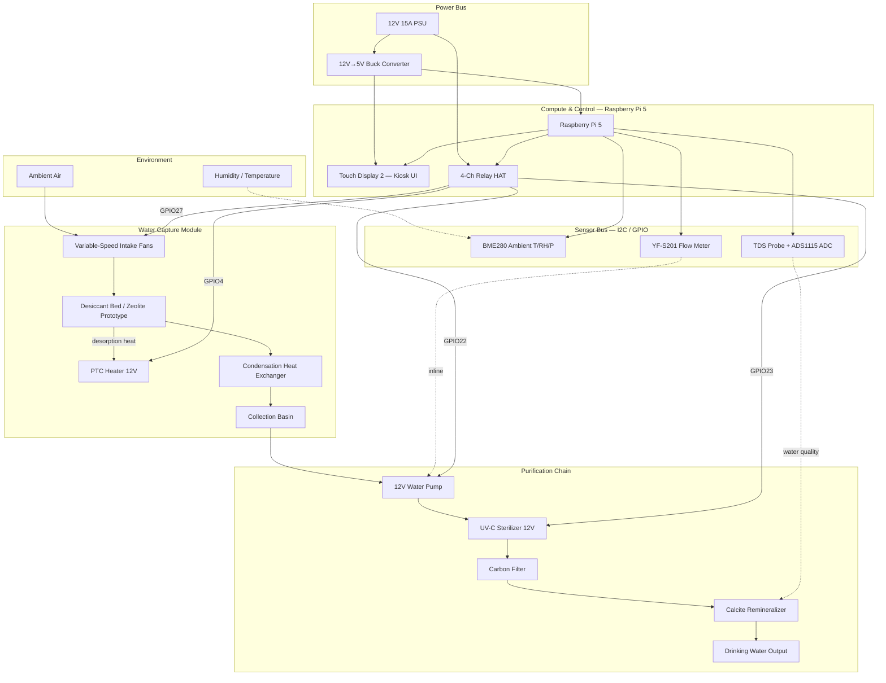

# AWG Prototype — System Block Diagram

**Source:** Reconstructed from Gemini chat wiring schematic ([share link](https://share.gemini.google/qS0VN4WEAgkJ))  
**Phase:** Pre-build reference (feeds Phase 5 PRD + Phase 9B CAD)  
**Status:** draft — validated against chat text; original Mermaid interactive visual had syntax errors

## High-level flow



## Three buses (from Gemini schematic documentation)

### 1. Power Bus
```
Wall AC → 12V 15A PSU (+)
    ├─→ 12V+ → Relay HAT COM inputs
    └─→ 12V→5V Buck → Pi Pin 2/4 (5V) + Touch Display
12V PSU (−) = system common ground (tie to buck GND + Pi GND)
```

### 2. Data & Sensor Bus (3.3V logic)
```
BME280:  VIN→3.3V(Pin1)  GND→Pin9  SDA→GPIO2(Pin3)  SCL→GPIO3(Pin5)
YF-S201: Red→5V  Black→GND  Yellow→GPIO17(Pin11) via voltage divider (5V→3.3V)
TDS:     Probe→ADS1115 ADC→Pi I2C (Pi has no native analog input)
```

### 2. Actuator Bus (relay-switched 12V)
```
Relay HAT stacked on Pi GPIO header
  Relay 1 (GPIO 4):  12V→NO, PTC heater→COM, heater−→GND
  Relay 2 (GPIO 27): 12V→NO, Condensation fan+→COM, fan−→GND
  Relay 3 (GPIO 22): 12V→NO, Pump+→COM, pump−→GND
  Relay 4 (GPIO 23): 12V→NO, UV-C+→COM, UV−→GND
```

## Assembly pitfalls (from source)

1. **Shared ground** — 12V PSU, buck converter, and Pi grounds must be tied; floating grounds cause sensor noise and relay failures.
2. **Flow meter logic level** — YF-S201 outputs 5V pulses; direct connection to GPIO17 will damage Pi 3.3V pins. Use voltage divider.
3. **Relay isolation** — Configure VCC/JD-VCC jumper on mechanical relay HAT to prevent inductive spikes from fans/heater reaching Pi logic.
4. **Sensor thermal isolation** — Mount BME280 in external vented pod; Pi 5 heat corrupts ambient RH readings.

## Physical layout (enclosure zones)

```
┌─────────────────────────────────────────┐
│  FRONT: Pi 5 + Touch Display (clean)    │
├─────────────────────────────────────────┤
│  MID:   Relay HAT, buck converter, PSU  │
├─────────────────────────────────────────┤
│  REAR:  Capture module, desiccant, PTC  │
│         Condensation HX, collection     │
├─────────────────────────────────────────┤
│  BOTTOM: Pump, filter chain, tubing     │
└─────────────────────────────────────────┘
     ╲
      ╲── External pod: BME280 (vented balcony)
```
