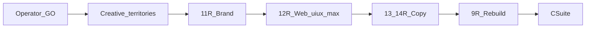

# Phase 25 — CEO Decision Brief: Creative Reboot (Skill-Max)

| Field | Value |
|-------|-------|
| Date | 2026-07-27 |
| Seat | `ceo-strategist` |
| Venture | `blacksage-kennels` |
| Type | Operator reject of craft quality → full creative reopen |
| Status | **GO locked** — aesthetic **B Working-Dog Cinema**; Q3 default photography-first + GLB upgrade |
| `llm_tier` | `frontier-reasoning` |
| `llm_model` | `grok-4.5` |
| `generation_used` | `none` |
| `fallback_applied` | `false` |

---

## 1. Restated operator ask

After previewing Option C (scroll-3D Hybrid), the operator wants:

1. **A completely new design** — not polish on the current geometric stand-in / overlay stack.
2. Work **sent back to CEO** for strategy/creative authority (not a silent eng patch).
3. **Leverage every relevant skill we have** to produce something **unique and amazing** — explicit rejection of under-loaded craft (e.g. ui-ux-pro-max wired but unused in 12c).

---

## 2. CEO verdict on current Option C craft

| Layer | Verdict | Notes |
|-------|---------|-------|
| **Product shape (1A + Hybrid)** | **HOLD** unless operator overrides | Scroll narrative home + multi-page proof IA still matches stated Option C lock |
| **Visual / UX craft (11b–12c–9d)** | **REJECT — rebuild** | Current output fails “unique and amazing”; stand-in reads as prototype; overlays/camera not prestige-grade; skill packs underused |
| **Trust locks (D2 Hybrid, CTA, routes)** | **HOLD** | Do not invent apply-first or drop proof band |
| **Brand tokens (black/tan)** | **REOPEN for elevation** | Keep ADRK black/tan metaphor; allow full system redesign within that family (type, motion, materials, composition) |

**CEO framing:** This is a **craft failure under a correct product bet**, not a return to Mode E empty spectacle. Strategy product shape can stay; creative + build must start over with **Skill-Max** discipline.

---

## 3. What “Skill-Max” means (non-negotiable for reboot)

Every craft seat **must** read and apply listed packs before writing artifacts. Tracker / handoffs must log **Skills used** with pack paths. Orchestrator may **block merge** if packs are missing from the handoff.

### Creative Director (manager) — must load

| Pack | Why |
|------|-----|
| `ui-ux-pro-max-skill/brand/` + `design-system/` | Distinctive system, not defaults |
| `ui-ux-pro-max-skill/ui-ux-pro-max/` | CLI / design exploration |
| `openmontage/.../web-design-guidelines/` | Web QA |
| `openmontage/.../flux-best-practices/` + `visual-style/` | Image/direction QA |
| `openmontage/.../threejs-fundamentals/` | 3D scope that serves brand |
| `awesome.../discover-brand/` + `brand-guidelines/` | Brand rigor |

### Brand Designer — must load

| Pack | Why |
|------|-----|
| All brand-designer table packs including **flux-best-practices**, **flux-image**, **bfl-api**, **visual-style**, **visual-skills/image**, **inference-sh**, **theme-factory**, **banner-design** | Unique stills / mood / hero photography direction |

### Web Designer — must load

| Pack | Why |
|------|-----|
| **ui-ux-pro-max** (all three: cli, design, ui-styling) | Was missing in 12c — mandatory this pass |
| `site-architecture/`, `frontend-design/`, `figma-implement-design/` | IA + implementable UI |
| `web-design-guidelines/`, `tailwind-design-system/`, `framer-motion/` | Motion + tokens |
| `threejs-fundamentals/`, `shadcn/`, `figma-design-to-code/`, `visual-skills/image/` | 3D constraints + UI craft |

### Copy Chief (home chapters) — must load

| Pack | Why |
|------|-----|
| Full copy-chief table (marketingskills + advertising copy-chief + natural-human-voice) | Voice that matches prestige without generic kennel copy |

### Tech Lead / CTO (rebuild) — must load

| Pack | Why |
|------|-----|
| Full threejs-* set + vercel-react-best-practices + composition-patterns + TDD + verification-before-completion + nextjs/shadcn | Cinematic quality, not geometric placeholder as hero |

**Explicit ban:** Shipping another pass that only touches threejs lighting while skipping ui-ux-pro-max / brand / flux.

---

## 4. Recommended reopen plan (Skill-Max Creative Reboot)

Do **not** mark phases ✅ until C-suite gates pass with Skills-used logged.

| Step | Owner | Output |
|------|-------|--------|
| **0. Operator GO** | Operator | Confirm §8 answers |
| **1. Creative territories** | `creative-director` → brand + web | 3 distinct visual territories (mood, type, 3D role, motion); pick one with operator |
| **2. Phase 11-R** | brand-designer | New brand system elevation (still black/tan family); mood + hero still direction via FLUX packs |
| **3. Phase 12-R** | web-designer | **Full** IA/surface redesign for scroll Hybrid; ui-ux-pro-max run required; storyboard + reduced-motion |
| **4. Phase 13/14-R** | copy-chief | Home chapter + overlay voice rewrite |
| **5. Phase 9-R** | tech-lead | **Rebuild** home experience to match 12-R (not patch 9d); licensed GLB pipeline first-class |
| **6. C-suite** | ceo | Gate each step; consistency check |

---

## 5. Held vs reopened locks

| Lock | Action |
|------|--------|
| D2 Hybrid — proof before inquire, routes, CTA wording | **HOLD** |
| SD4-C — scroll-3D primary on home only | **HOLD** (product); craft reopened |
| Black/tan ADRK metaphor | **HOLD metaphor / REOPEN expression** |
| Option C 12c storyboard + 9d HomeScrollStage visuals | **SUPERSEDE** — rebuild-not-patch |
| Mode E guardrails (fallback, no empty spectacle, home-only WebGL) | **HOLD** |

---

## 6. Success bar (CEO)

A reboot is only “amazing enough” if:

1. First viewport could not belong to a generic AI kennel template after removing the wordmark.
2. ui-ux-pro-max + brand/FLUX packs appear in handoff **Skills used** with concrete decisions tied to outputs.
3. 3D subject reads as breed-serious (licensed GLB or photoreal path), not box-capsule demo — or honest photography-led hero if GLB still absent **by design**.
4. Proof band and inquire path remain stronger than the spectacle.
5. Secondary pages feel like the same world, not a leftover Option B site.

---

## 7. What this brief does *not* authorize yet

- No silent eng restyle without creative-director ownership
- No dropping Hybrid proof / multi-page IA
- No Phase 15 video reopen (still skipped unless operator asks)
- No hard-launch unblock

---

## 8. Ask for operator (max 3)

1. **Confirm reboot GO** — Approve Skill-Max Creative Reboot (§4) holding Hybrid + SD4-C product shape?
2. **Aesthetic north star** (pick one or write your own):  
   - **A)** Dark museum / gallery kennel (quiet luxury, large type, sparse)  
   - **B)** Working-dog cinema (cinematic scroll, film grain, dramatic light)  
   - **C)** Editorial breed journal (tactile print + selective 3D)  
   - **D)** Operator-defined: ________________
3. **GLB commitment** — Will you purchase/drop licensed undocked-tail GLB this reboot, or should creative design a **photography-first** prestige path until the asset exists?

---

## 9. Return summary

| Item | Value |
|------|-------|
| **On current craft** | **REJECT** — send back for full creative reboot |
| **On product shape** | **HOLD** 1A + Hybrid (unless operator changes §8) |
| **Mandate** | **Skill-Max** — every seat loads full pack table; ui-ux-pro-max mandatory on web |
| **Next** | Await §8 → dispatch `creative-director` for territories |

---

## Reporting

Orchestrator: do **not** spawn creative ICs until operator answers §8.  
After GO: `creative-director` owns territories → 11-R → 12-R; CMO/copy for 13/14-R; CTO for 9-R.
